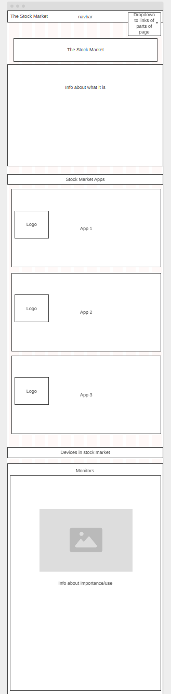
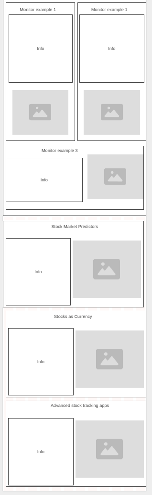
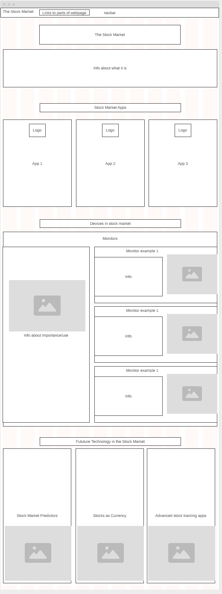

# Entry 6: Making my MVP (Minimum Viable Product)
##### 05/12/2025

## Content

### Making a Plan

Before starting to make by website i started by making a plan. I first made multiple **wireframes** to plan out how my website should look for different screen sizes.

#### Mobile Wireframe:

#### Computer Wifeframe:

[Previous](entry05.md) | [Next](entry07.md)

[Home](../README.md)
